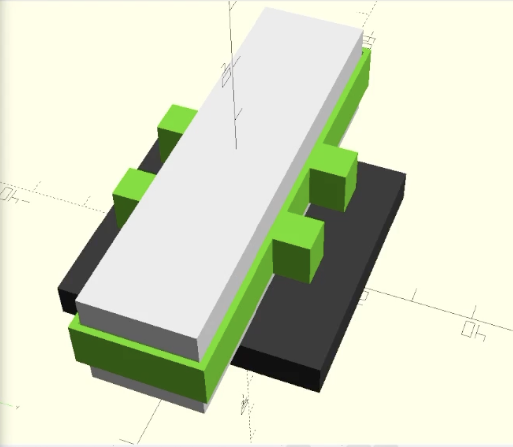

# Toothpick battery holder

Designs for a band that goes around drone batteries and stops them from slipping
out of their mounting.

## Files

* [GMB 550 3s LiPo/LiHV](./out/holder-3s-550.stl)
* [GMB 850 4s LiHV](./out/holder-4s-850.stl)

If you need other files, clone the repo and adjust the settings, or stick an
issue on this repo (or find me some other way), and I'll generate it for you.
